# Screenshots & UI Overview

Below are screenshots of the main features and pages of the Task Management System. This section helps you quickly visualize the app's capabilities and UI.

| Page / Feature         | Screenshot                                           |
| ---------------------- | ---------------------------------------------------- |
| Login Page             | 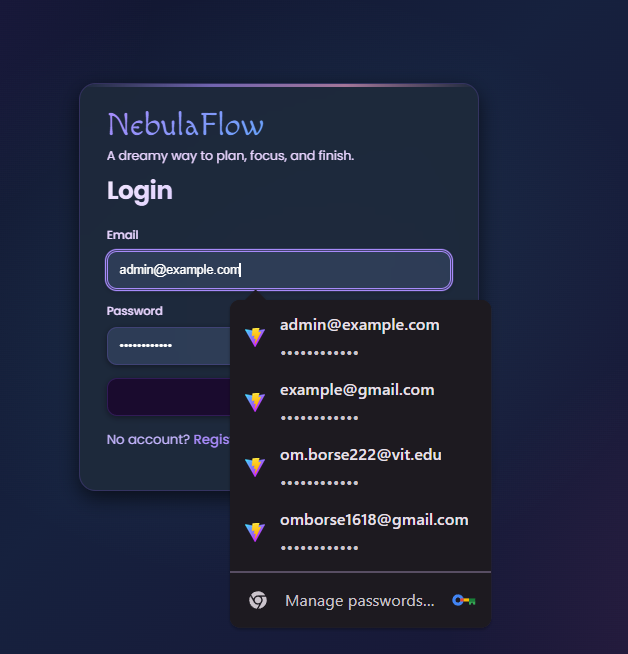                  |
| Admin Dashboard        | 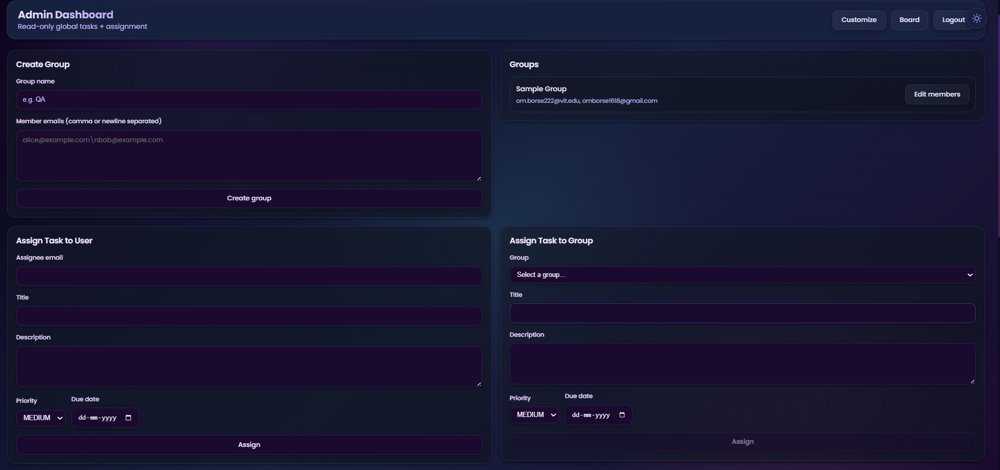 |
| Admin Dashboard        | 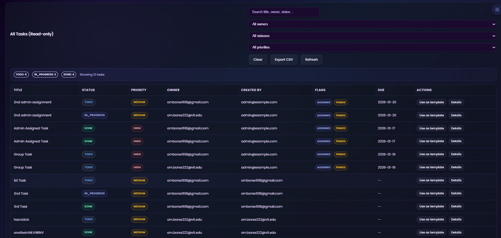 |
| Task Board (Kanban)    | 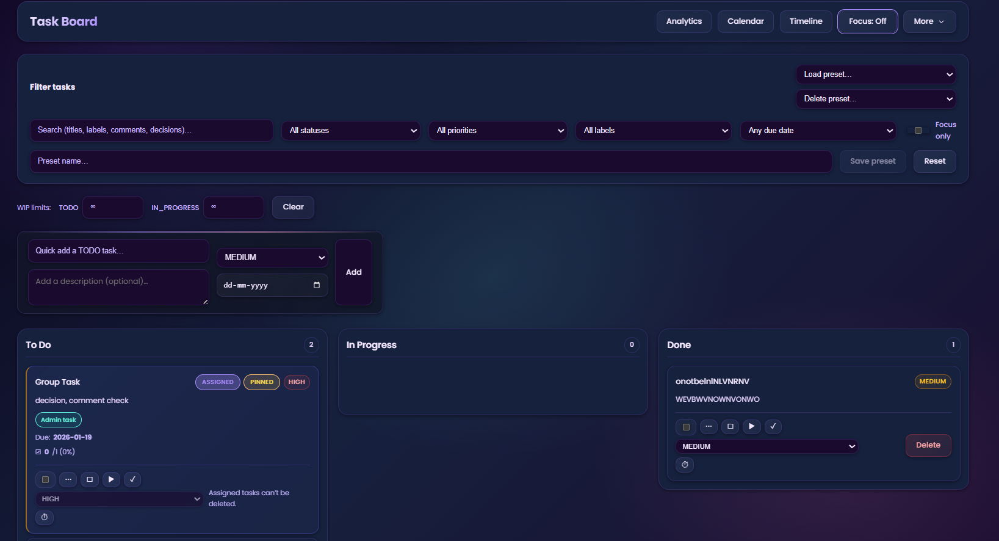              |
| Drag & Drop            | 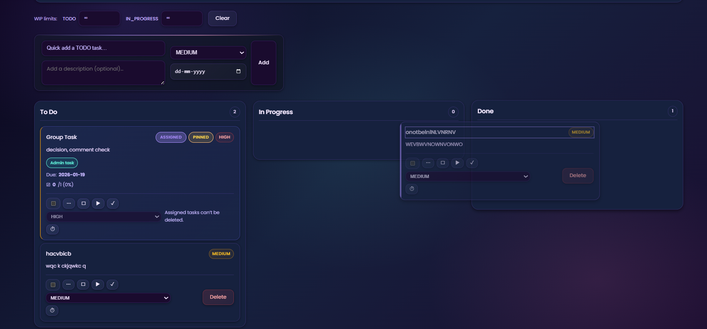             |
| Task Description Modal | 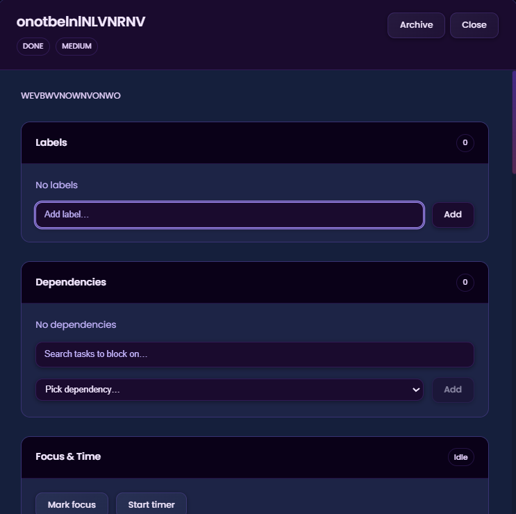  |
| Focus Mode             | 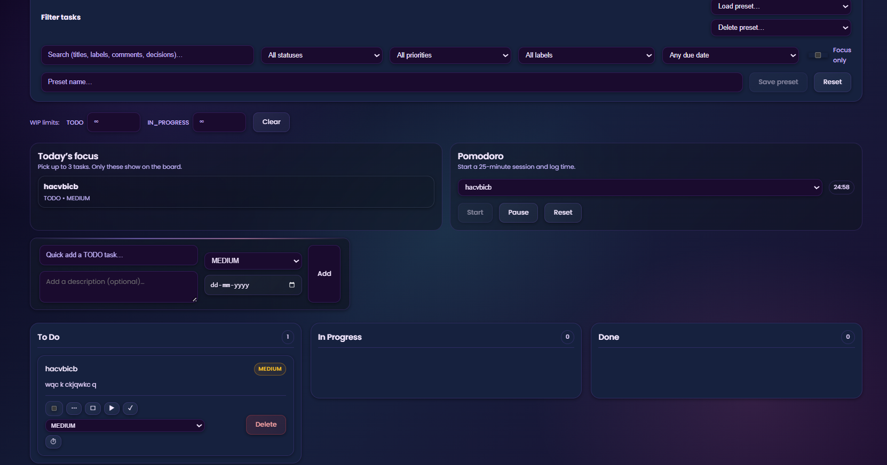                  |
| Calendar View          | 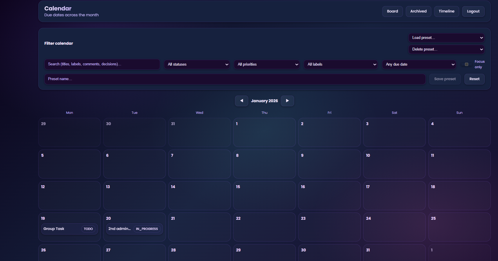                     |
| Timeline View          | 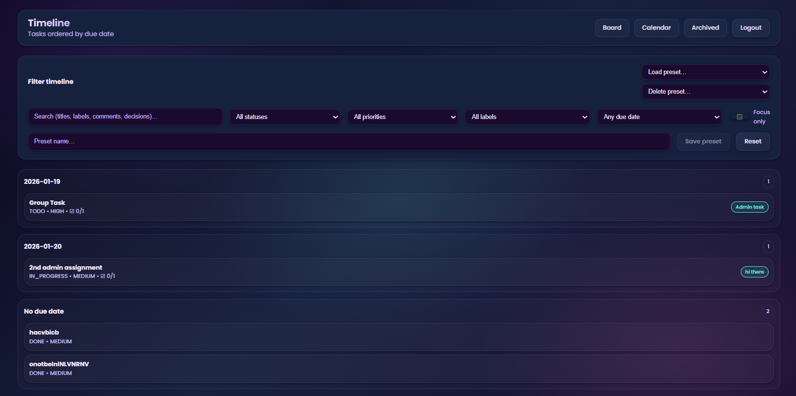                 |
| Analytics              | 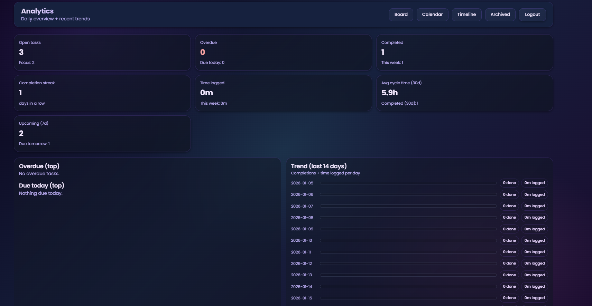               |
| Archive Page           | 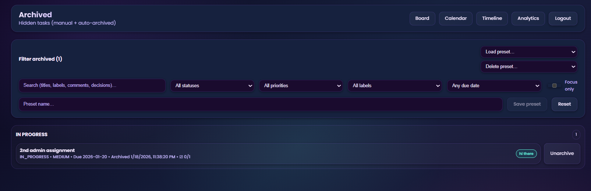                   |

---

_For more details on features, setup, and API, see below._
